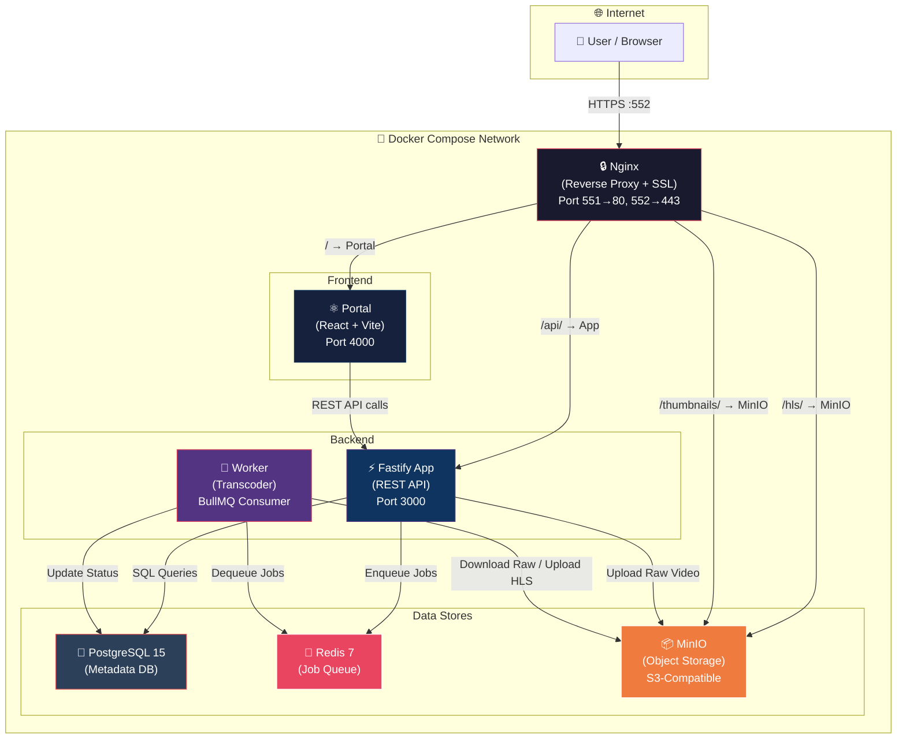
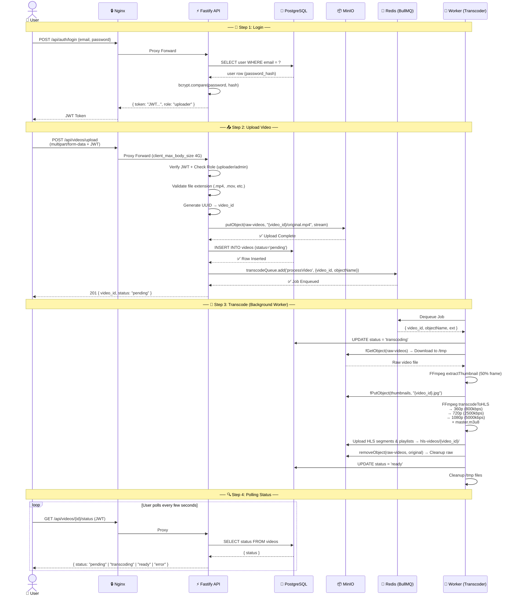
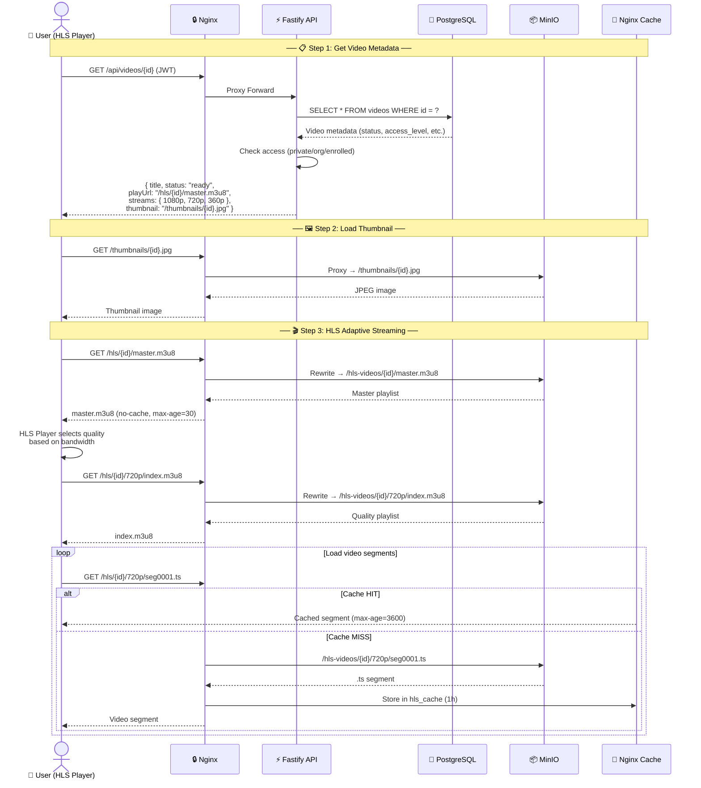
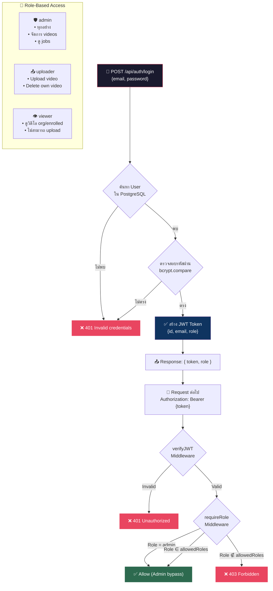
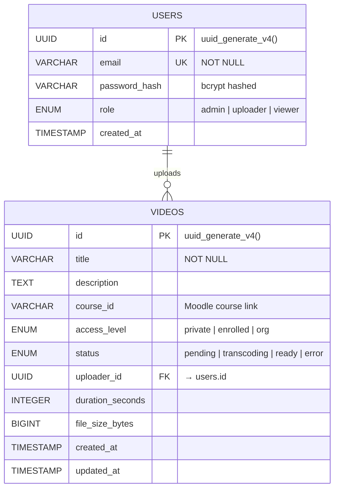
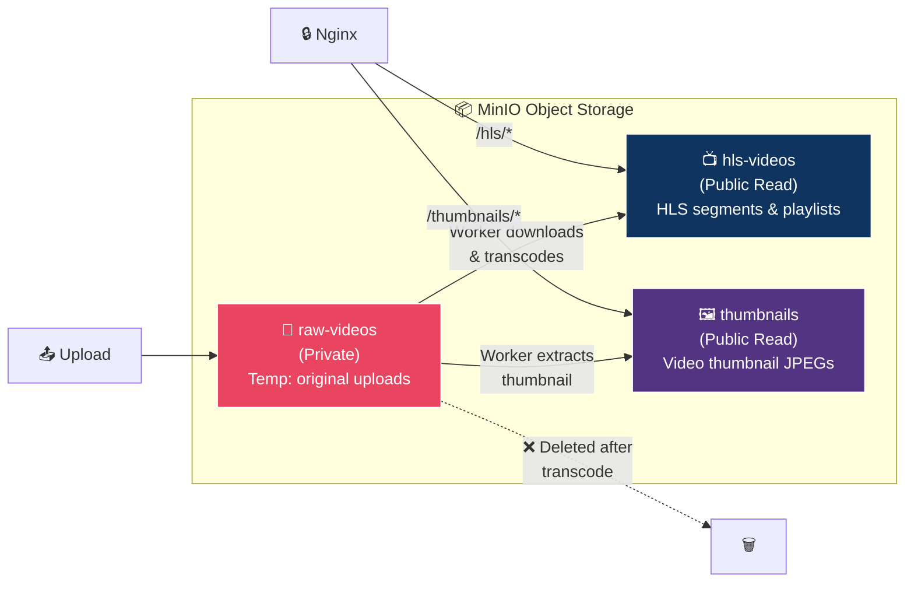

# 🎬 Video Server — Project Architecture & Workflow

## 1. ภาพรวมโครงสร้าง Infrastructure (Docker Compose)

---

## 2. ขั้นตอนการ Upload & Transcode วิดีโอ (Step-by-Step)

---

## 3. ขั้นตอนการ Stream / เล่นวิดีโอ (HLS Playback)

---

## 4. ระบบ Authentication & Authorization

---

## 5. Database ER Diagram

---

## 6. สรุป API Endpoints

| Method | Endpoint | Auth | Role | Description |
|--------|----------|------|------|-------------|
| `POST` | `/api/auth/login` | ❌ | — | Login รับ JWT Token |
| `POST` | `/api/videos/upload` | ✅ | uploader, admin | Upload วิดีโอ |
| `GET` | `/api/videos` | ✅ | any | List วิดีโอ (paginated) |
| `GET` | `/api/videos/:id` | ✅ | any | Metadata + HLS URLs |
| `GET` | `/api/videos/:id/status` | ✅ | any | Polling สถานะ transcode |
| `DELETE` | `/api/videos/:id` | ✅ | uploader (own), admin | ลบวิดีโอ + cleanup MinIO |
| `GET` | `/api/admin/videos` | ✅ | admin | List all วิดีโอ |
| `GET` | `/api/admin/jobs` | ✅ | admin | สถานะ BullMQ queue |
| `PATCH` | `/api/admin/videos/:id` | ✅ | admin | แก้ title, access_level |
| `GET` | `/api/health` | ❌ | — | Health check |

---

## 7. MinIO Storage Buckets

